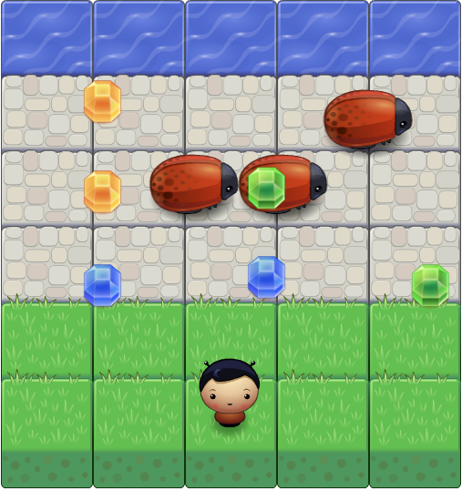

Arcade Game Clone - FEND
===============================

## [Click here to play online!](https://patel-jenu-1991.github.io/frontend-nanodegree-arcade-game/index.html)



# How to play the game?

* Use arrow keys to move around
* Beware of bug bites or you'll be brought back to the start point
* Try and collect as many gems as you can
* Hop into the water dodging the bugs to win the game
* Most of all enjoy the game!!

# How to install the game?

## Option 1
[Click Here](https://github.com/Patel-Jenu-1991/frontend-nanodegree-arcade-game/archive/master.zip) to Download the **zip** file and **extract** it.

## Option 2
Clone the repository by running the following command at your terminal:
```
$ git clone https://github.com/Patel-Jenu-1991/frontend-nanodegree-arcade-game.git
```

Once you obtain the files run **index.html** in your favorite browser to enjoy the game.

# Original Classroom Instructions
Students should use this [rubric](https://review.udacity.com/#!/projects/2696458597/rubric) for self-checking their submission. Make sure the functions you write are **object-oriented** - either class functions (like Player and Enemy) or class prototype functions such as Enemy.prototype.checkCollisions, and that the keyword 'this' is used appropriately within your class and class prototype functions to refer to the object the function is called upon. Also be sure that the **readme.md** file is updated with your instructions on both how to 1. Run and 2. Play your arcade game.

For detailed instructions on how to get started, check out this [guide](https://docs.google.com/document/d/1v01aScPjSWCCWQLIpFqvg3-vXLH2e8_SZQKC8jNO0Dc/pub?embedded=true).

# License
This game has no license you're free do whatever you want with it (Open Source Web Development Initiative).
